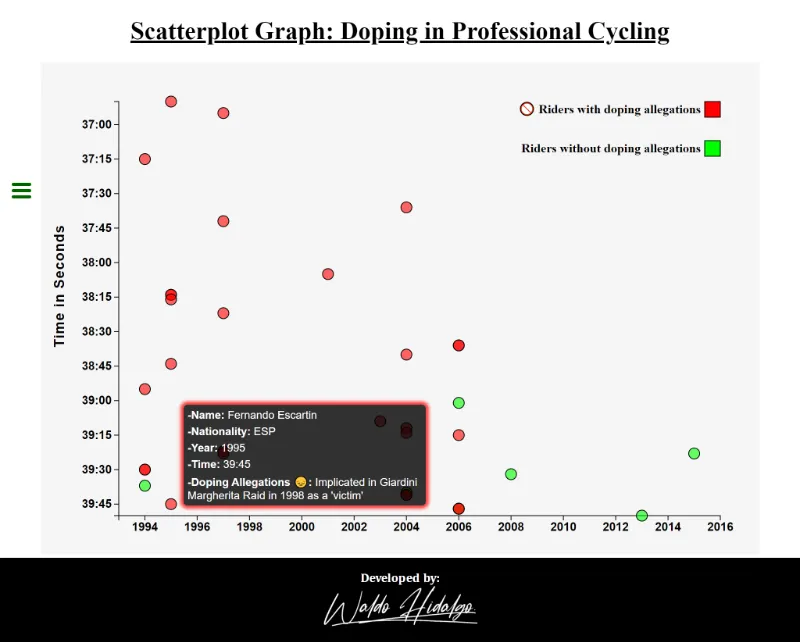
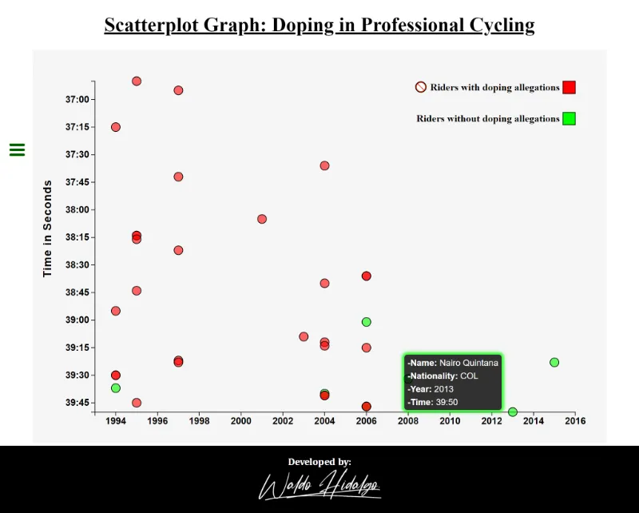

# Scatterplot Graph: Doping in Professional Cycling

Segundo proyecto llamado [**Visualize Data with a Scatterplot Graph**](https://www.freecodecamp.org/learn/data-visualization/data-visualization-projects/visualize-data-with-a-scatterplot-graph) el cual es requisito obligatorio para obtener la [Data Visualization](https://www.freecodecamp.org/learn/data-visualization/) de freecodecamp.

## Tabla de Contenidos

- [Scatterplot Graph: Doping in Professional Cycling](#scatterplot-graph-doping-in-professional-cycling)
  - [Tabla de Contenidos](#tabla-de-contenidos)
  - [Requisitos](#requisitos)
  - [All Test Passed](#all-test-passed)
  - [Screenshots](#screenshots)
    - [1. Home](#1-home)
    - [2. Tooltips dentro del svg](#2-tooltips-dentro-del-svg)
      - [2.1. Tooltip Superior](#21-tooltip-superior)
      - [2.2. Tooltip Inferior Izquierdo](#22-tooltip-inferior-izquierdo)
      - [2.2. Tooltip Inferior Derecho](#22-tooltip-inferior-derecho)

## Requisitos

## All Test Passed

## Screenshots

### 1. Home

### 2. Tooltips dentro del svg

#### 2.1. Tooltip Superior

#### 2.2. Tooltip Inferior Izquierdo

#### 2.2. Tooltip Inferior Derecho

